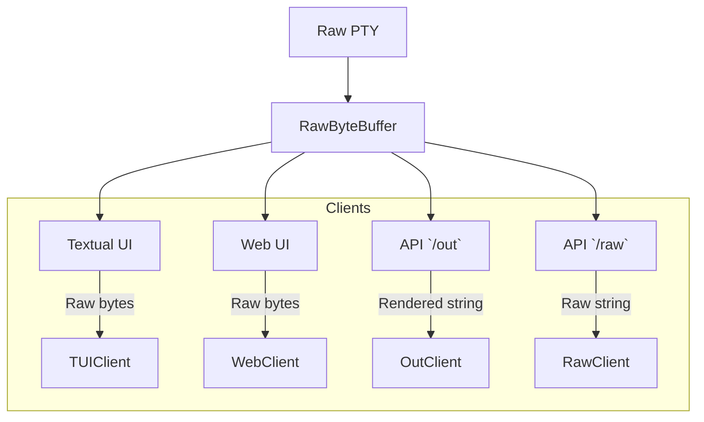

### PTY Implementation Overview

SILC uses a **cross‑platform PTY abstraction** to launch and interact with shell processes.  The abstraction is defined by `PTYBase` and instantiated by `create_pty`.  It supports Unix (pty module), Windows (pywinpty/winpty), and a stub fallback.

#### Data Flow Diagram


- **Raw PTY** produces raw byte streams from the underlying shell process.
- **RingBuffer** (see `core/raw_buffer.py`) stores the latest bytes and supports efficient snapshotting.
- **Clients** (Textual TUI, Web UI, API endpoints) read from the buffer:
  - `/out` and `/raw` endpoints return **cleaned** output (sentinel‑free).  `/out` renders using `pyte` if available, otherwise falls back to cleaned raw data.
  - TUI/Web UI receive the raw byte stream via WebSocket or direct HTTP streaming.

#### PTYBase
- `read(size) -> bytes` – Asynchronously read from the master side.
- `write(data) -> None` – Send input to the shell.
- `resize(rows, cols)` – Change terminal dimensions.
- `kill()` – Terminate the underlying process.

#### UnixPTY
- Uses `pty.openpty()` to create a master‑slave pair.
- Spawns the shell via `subprocess.Popen` with `preexec_fn=os.setsid` to create a new process group.
- Reads/writes via the master file descriptor.
- Resizes with `ioctl` (`TIOCSWINSZ`).
- Kills the shell process and closes the FD.

#### WindowsPTY
- Loads `winpty` or `pywinpty`.
- Spawns the shell process via `winpty.PtyProcess.spawn` or `winpty.PTY`.
- Provides synchronous read/write wrapped in `loop.run_in_executor` for async compatibility.
- Resizes via the backend’s `set_size` method.
- Kills the process and any child processes.

#### StubPTY
Fallback used when the platform‑specific PTY cannot be loaded.  Methods are no‑ops; they simply sleep.

#### Factory `create_pty`
- Detects `sys.platform` and returns the best PTY implementation.
- If the platform is unsupported, `StubPTY` is returned.

#### Usage
```python
from silc.core.pty_manager import create_pty
pty = create_pty()
await pty.write(b"echo hello\n")
output = await pty.read(4096)
```

---
